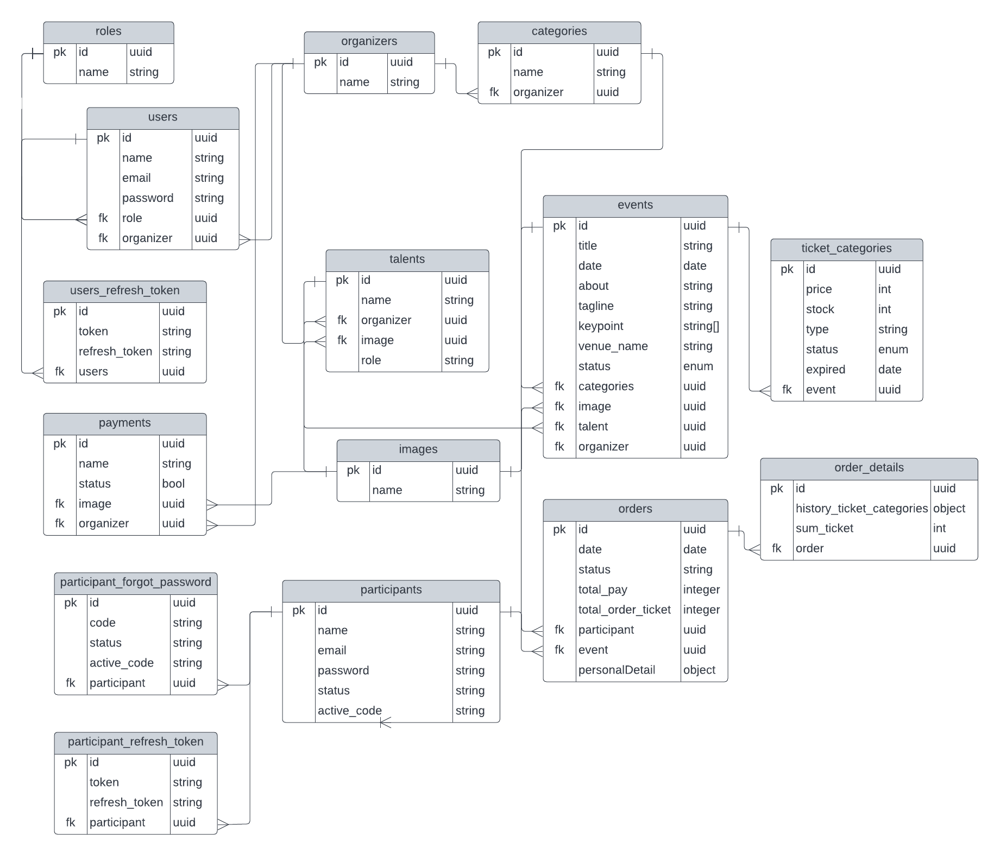

<h2 align="center">Looket-Server</h2>

Web Server/Backend untuk Project Website Jual Beli Tiket secara Online.

## Daftar Isi

- [Teknologi](#teknologi)
- [Flow Aplikasi](#flow-aplikasi)
- [Entity Relationship Diagram](#entity-relationship-diagram)
- [Daftar API ENDPOINT](#daftar-api-endpoint)
- [Cara Install dan Setup](#cara-install-dan-setup)
- [Repo Web Client atau Frontend](#repo-web-client-atau-frontend)
- [Lisensi](#lisensi)

## Teknologi
- [JavaScript](https://www.javascript.com/)
- [Node.js](https://nodejs.org/en/)
- [Express.js](https://expressjs.com/), Web Server ini dibangun menggunakan [Express Generator](https://expressjs.com/en/starter/generator.html)
- [MongoDB](https://www.mongodb.com/), dengan menggunakan ORM (Object Relational Mapping) [Mongoose](https://mongoosejs.com/)

## Flow Aplikasi

| Aktor           | Aksi                                                                    |
| :-------------- | :---------------------------------------------------------------------- |
| Owner (CMS)     | Mengelola data organizers (create, read, update, delete and filter)     |
| Owner (CMS)     | Approved Events                                                         |
| Owner (CMS)     | Mengelola list orders (filter by date and filter by event)              |
| Organizer (cms) | Mengelola data users (create, read, update and delete)                  |
| Organizer (cms) | Mengelola data categories (create, read, update and delete)             |
| Organizer (cms) | Mengelola data events (create, read, update, delete and filter)         |
| Organizer (cms) | Memasukan ticket categories kedalam event (create, update and delete)   |
| Organizer (cms) | Memasukan payment kedalam event (create, update and delete)             |
| Organizer (cms) | Mengelola data list orders (filter by date and filter by event)         |
| Admin           | Mengelola data list orders (filter by date and filter by event)         |
| Participant     | Mendaftar, masuk and forgot password                                    |
| Participant     | Melihat daftar event                                                    |
| Participant     | Melihat detail data event by id                                         |
| Participant     | Melakukan order / checkout                                              |
| Participant     | Melihat history order event                                             |

## Entity Relationship Diagram

## Daftar API ENDPOINT

API ini di test / uji dengan menggunakan Aplikasi Postman Desktop (WIP)

| Nama          | Routes                               | HTTP   | Deskripsi                         | Dibuat | Hasil Test | Middleware `Auth` |
| :------------ | :---------------------------------   | :----- | :-------------------------------- | :----- | :--------- | :---------------- |
| `Categories`                                                                                                                                |
|               | /api/v1/cms/categories               | GET    | Get all categories                | Sudah  |            | Ya                |
|               | /api/v1/cms/categories               | POST   | Create categories                 |        |            | Ya                |
|               | /api/v1/cms/categories/:id           | GET    | Get one categories by id          |        |            | Ya                |
|               | /api/v1/cms/categories/:id           | PUT    | Update categories                 |        |            | Ya                |
|               | /api/v1/cms/categories/:id           | DELETE | Delete categories                 |        |            | Ya                |
| `Talents`                                                                                                                                   |
|               | /api/v1/cms/talents                  | GET    | Get all talents                   |        |            | Ya                |

<!--
| `/api/auth/gmail-link`       | GET    | GET gmai link                               | Sudah  | OK         | Tidak             |
 -->

## Cara Install dan Setup

Clone atau Download repository ini. 
Dibutuhkan `node` dan `npm` yang telah terinstall secara global pada komputer atau laptop anda.  

- Install:

`npm install`  

- Untuk menjalankan web server:

`npm run dev`  

- Akses ENDPOINT menggunakan aplikasi [Postman](https://www.postman.com/)
  Contoh: 
  - Get all categories: `localhost:9000/api/v1/cms/categories`

## Repo Web Client atau Frontend

Work In Progress

## Lisensi

MIT
